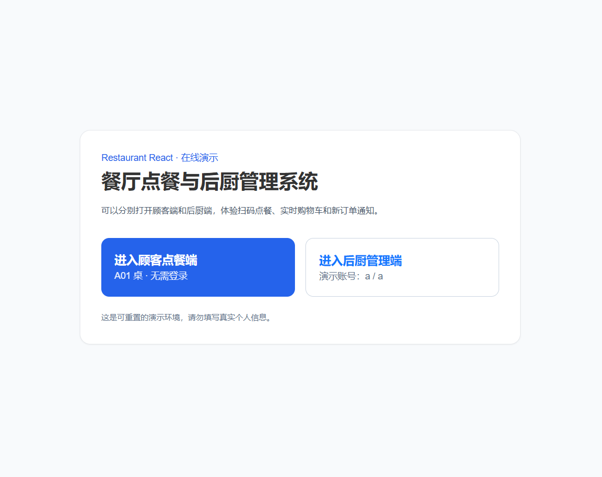
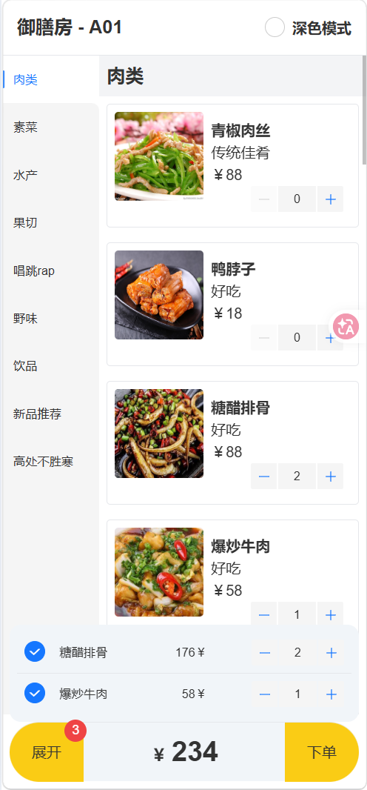
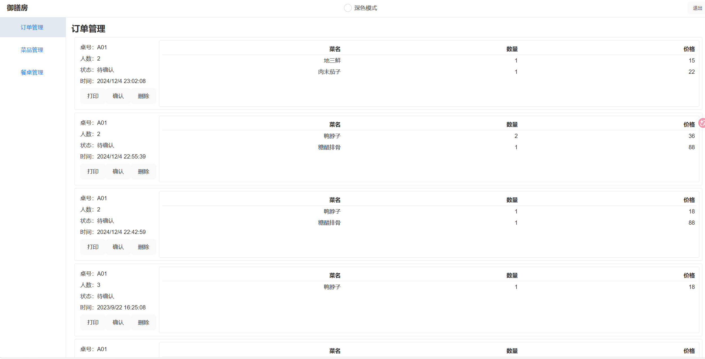

# Restaurant React

一个覆盖顾客点餐与后厨管理完整流程的全栈餐厅演示项目。顾客可以扫码进入餐桌、浏览菜单、同步购物车并提交订单；后厨可以实时接收新订单，并管理订单、菜品和餐桌。

## 在线演示

**演示地址：** [https://restaurant-react-demo.onrender.com/](https://restaurant-react-demo.onrender.com/)

| 入口 | 地址 / 凭据 |
| --- | --- |
| 顾客点餐端 | [进入 A01 桌点餐](https://restaurant-react-demo.onrender.com/landing/r/1/d/1) |
| 后厨管理端 | [进入后厨登录](https://restaurant-react-demo.onrender.com/login) |
| 演示账号 | `a` |
| 演示密码 | `a` |

> Render 免费服务长时间无人访问后会休眠，首次打开可能需要等待约一分钟。演示数据会在服务重启后恢复，请勿填写真实个人信息。

## 项目截图

### 演示首页

从统一入口分别进入顾客点餐端和后厨管理端。



### 顾客菜单与购物车

支持菜品分类、数量调整、购物车汇总、就餐人数选择和下单流程，并针对移动端进行布局适配。



### 后厨订单管理

后厨可以查看桌号、人数、菜品明细和订单状态，并对订单进行确认、完成、打印或删除操作。



## 核心功能

### 顾客点餐端

- 根据餐桌链接或二维码进入点餐页面
- 选择就餐人数并查看餐桌信息
- 按分类浏览菜单和菜品详情
- 调整菜品数量并实时计算总价
- 多个顾客通过 Socket.IO 同步同桌购物车
- 提交订单并接收下单成功状态
- 支持深色模式，并在本地保存用户偏好

### 后厨管理端

- 演示账号登录及登录状态保持
- 查看订单、菜品明细、桌号、人数和订单状态
- 通过 Socket.IO 实时接收新订单和页面通知
- 确认、完成、打印和删除订单
- 新增、编辑、上下架和删除菜品，支持图片上传
- 新增、编辑和删除餐桌
- 根据线上地址生成顾客点餐二维码

## 技术栈

### 前端

- React 19 + TypeScript
- Vite
- React Router
- Tailwind CSS
- Ant Design / Ant Design Mobile
- Jotai、MobX、Immer
- Axios
- Socket.IO Client

### 后端与部署

- Node.js 22+
- Express
- Socket.IO
- SQLite
- Multer
- Render Web Service

## 项目亮点

- 完整还原“选择餐桌 → 浏览菜单 → 同步购物车 → 提交订单 → 后厨接单”的业务链路
- 使用两个 Socket.IO 通道分别处理同桌购物车协作和后厨新订单通知
- 采用组件、页面、Hooks、状态管理和类型声明分层组织前端代码
- 开发环境保持前后端分离，生产环境由 Express 同域提供页面、API、图片和 WebSocket
- 使用可重置的 SQLite 演示数据库，访客可以实际增删改和下单，不会永久破坏展示数据
- 同时覆盖移动端顾客界面和桌面端后台管理界面

## 运行方式

要求安装 Node.js 22.5 或更高版本，并启用 Corepack。

```bash
corepack enable
pnpm install
pnpm build
pnpm start
```

启动后访问：

```text
http://localhost:5002
```

前端开发模式：

```bash
pnpm dev
```

Vite 会将 API、图片和 WebSocket 请求代理到本地 `5002` 端口，因此开发时需要同时启动后端服务。

## 部署说明

仓库根目录提供了 [`render.yaml`](./render.yaml)。Render 会自动完成以下流程：

1. 安装前端与后端依赖
2. 构建 React 生产资源
3. 使用 Express 启动 Web Service
4. 将 React、API、图片和 Socket.IO 暴露在同一个 HTTPS 域名下

免费实例的文件系统不是永久存储。项目启动时会从仓库中的种子数据库创建运行数据库，因此订单和后台修改会在服务重启后恢复。该设计适合作品演示；生产环境应改用持久数据库、对象存储和独立 Session 存储。

## 演示建议

为了体验实时功能，可以同时打开两个窗口：

1. 在普通窗口登录后厨端并进入订单管理
2. 在无痕窗口打开顾客点餐端
3. 选择菜品并提交订单
4. 查看后厨页面实时出现的新订单通知
